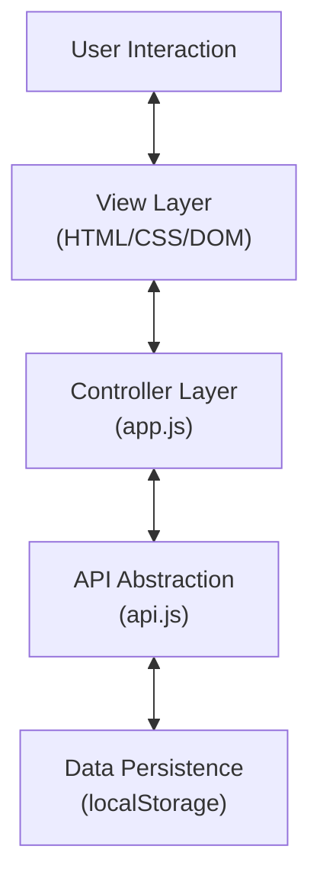

RuManager is a lightweight, secure, and centralized business management dashboard designed to run entirely in your browser. It streamlines financial tracking, partner coordination, scheduling, and operational tasks without the need for a complex server backend.

## 📖 Table of Contents
1. [Overview](#1-overview)
2. [Quick Start](#2-quick-start)
3. [System Architecture](#3-system-architecture)
4. [Technology Stack](#4-technology-stack)
5. [Data Model](#5-data-model)
6. [Key Features](#6-key-features)
7. [Project Structure](#7-project-structure)

---

### 1. Overview

**RuManager** abandons the traditional client-server complexity for a streamlined **Offline-First** approach. By leveraging modern browser capabilities, it offers zero-latency interactions and complete data privacy—your financial data never leaves your device.

### 2. Quick Start

No installation is required.

1.  Navigate to the `frontend` folder.
2.  Open `index.html` in any modern web browser (Chrome, Edge, Firefox, Safari).
3.  **That's it!** The application is ready to use.

> **Note**: For a better development experience, you can use a local server (e.g., Live Server in VS Code, or `python -m http.server`), but it is not strictly necessary.

---

### 3. System Architecture

RuManager follows a **Client-Side MVC (Model-View-Controller)** pattern. This ensures a clean separation of concerns, making the codebase maintainable and scalable.

#### High-Level Architecture Diagram


#### Component Breakdown

1.  **View Layer (The Interface)**
    *   **HTML5/CSS3**: Provides the structure and "Glassmorphism" styling.
    *   **Dynamic Rendering**: The UI updates instantly via DOM manipulation without page reloads (Single Page Application feel).
    *   **SVG Icons**: All iconography uses inline SVGs for crisp rendering at any scale.

2.  **Controller Layer (`app.js`)**
    *   **The Orchestrator**: Handles all user input, navigation, and application logic.
    *   **Event Driven**: Listens for clicks, form submissions, and tab changes.
    *   **Generic Form Engine**: A configuration-driven system that dynamically generates forms for Transactions, Partners, Schedules, or Tasks, reducing code duplication by 60%.

3.  **Model / Data Layer (`api.js`)**
    *   **Backend Abstraction**: Connects the generic Controller requests (like `createTransaction`) to the specific storage implementation.
    *   **Mock API**: It "pretends" to be a server. Async methods return Promises, meaning you could swap this file for a real Node.js/Python backend connector later without changing the UI.
    *   **Data Integrity**: Handles ID generation (UUIDs), data type conversion, and the "Permanent Delete" logic.

---

### 4. Technology Stack

| Component | Technology | Reasoning |
|-----------|------------|-----------|
| **Core** | HTML5, JavaScript (ES6+) | Native performance, no compilation build steps needed. |
| **Styling** | CSS3 (Vanilla) | Custom variables and Flexbox/Grid for a tailored, fast design system. |
| **Database** | `localStorage` | Persistent, key-value storage available in 100% of browsers. |
| **Icons** | SVG | Lightweight, scalable, and stylable via CSS. |

---

### 5. Data Model

Data is stored as JSON collections within the browser's Local Storage.

*   **Transactions**: `id`, `type` (income/expense), `amount`, `status`, `date`, `description`, `partner_id`.
*   **Partners**: `id`, `company_name`, `contact_details`, `status`.
*   **Schedules**: `id`, `title`, `start_time`, `end_time`, `status`, `partner_id`.
*   **Tasks**: `id`, `title`, `priority`, `due_date`, `status` (todo/in_progress/done).

**Persistence & Privacy**: 
Crucially, when data is deleted in RuManager, it is permanently removed. An "Initialized" flag system prevents demo data from reappearing after you clear it, ensuring your workspace remains yours.

---

### 6. Key Features

*   ** Smart Dashboard**: Real-time aggregation of Total Balance, Income, Expenses, and active stats.
*   ** Financial Tracking**: Log business transactions with status badges and partner associations.
*   ** Partner Directory**: Keep detailed records of your business relationships (Clients/Suppliers).
*   ** Calendar & Tasks**: Integrated scheduling and priority-based task management.
*   ** Zero Latency**: All operations happen instantly on the client side.

---

### 7. Project Structure

```text
business-management-system/
├── frontend/
│   ├── index.html        # Entry point
│   ├── css/
│   │   └── styles.css    # Global styles & theming
│   ├── js/
│   │   ├── app.js        # Controller logic & UI rendering
│   │   └── api.js        # Data interface & Storage logic
│   └── assets/           # Startic images (if any)
└── README.md             # System documentation
```


